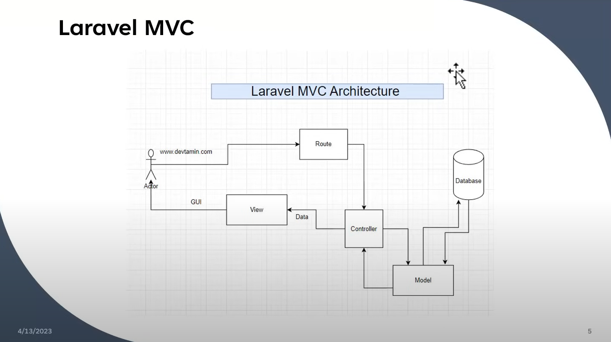

# Laravel CRUD Application for Products

# Features

 **Create**: Add new products with name, quantity, price, and description.
 **Read**: View a list of all products with their details.
 **Update**: Modify existing product details.
 **Delete**: Remove products from the database.

# Requirements

- PHP (>= 7.3)
- Composer
- Laravel (>= 8.x)
- Database (MySQL, PostgreSQL, SQLite, SQL Server, etc.)

## Installation

1. Clone the repository:
   ```bash
   git clone https://github.com/your-username/your-repository.git
   ```

2. Navigate to the project directory:
   ```bash
   cd your-repository
   ```

3. Install dependencies via Composer:
   ```bash
   composer install
   ```

4. Copy the `.env.example` file and rename it to `.env`. Update the database configuration in the `.env` file.

5. Generate an application key:
   ```bash
   php artisan key:generate
   ```

6. Run database migrations:
   ```bash
   php artisan migrate
   ```

7. Serve the application:
   ```bash
   php artisan serve
   ```

8. Open your browser and navigate to `http://127.0.0.1:8000` to access the application.

## Usage

- Create a new product: Click on the "Create a Product" link on the home page and fill in the product details.
- View all products: Visit the home page to see a list of all products.
- Edit a product: Click on the "Edit" link next to a product on the home page to modify its details.
- Delete a product: Click on the "Delete" button next to a product on the home page to remove it from the database.

## Contributing

Contributions are welcome! Please feel free to submit a pull request or open an issue if you encounter any problems or have suggestions for improvement.

## License

This project is licensed under the [MIT License](LICENSE).
```
